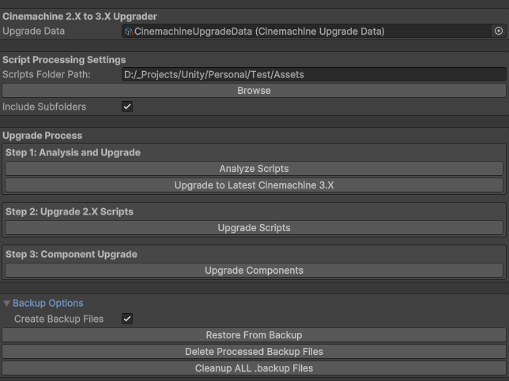

# Cinemachine Upgrader Tool

## Overview
The Cinemachine Upgrader Tool is designed to simplify the process of upgrading Cinemachine components in Unity projects from version 2.X to version 3.0.0. It automates the analysis, upgrade, and component adjustments, reducing manual effort and potential errors.

This tool consists of two scripts:
1. **CinemachineUpgraderTool.cs** - Provides a Unity Editor window to handle the upgrade process.
2. **CinemachineUpgradeData.cs** - Stores configuration data for the upgrade, including component mappings and replacements.

---

## Features
- **Automated Script Analysis:** Detects Cinemachine components in your project.
- **Namespace and Method Upgrades:** Updates outdated namespaces and method names.
- **Component Field Replacements:** Handles field name changes during the upgrade.
- **Backup System:** Creates backups of modified files for safety.
- **Restore and Cleanup:** Offers options to restore backups and clean unused files.

---

## Requirements
- Unity Editor version **2023.1 or later**.

---

## Installation

1. **Clone or Download** the repository.
2. Move the `CinemachineUpgraderTool.cs` and `CinemachineUpgradeData.cs` files to your Unity project's `Assets/Editor` folder.
3. Create an `Upgrade Data` asset:
    - Right-click in your Unity Project window.
    - Navigate to `Create > Cinemachine > Upgrade Data`.
    - Save the asset as `CinemachineUpgradeData.asset`.

---

## Usage Instructions

### 1. Open the Tool
- In Unity, go to `Tools > Cinemachine Upgrader`.
- This will open the Cinemachine Upgrader Tool window.

### 2. Assign Upgrade Data
- Drag the `CinemachineUpgradeData.asset` into the `Upgrade Data` field.
- If you don't have one, click **Create New Upgrade Data** in the tool.

### 3. Configure Settings
- Specify the folder path containing your scripts under `Scripts Folder Path`.
- Enable or disable the `Include Subfolders` option depending on your project structure.

### 4. Upgrade Process

#### Step 1: Analyze Scripts
- Click the **Analyze Scripts** button.
- The tool scans your scripts to identify Cinemachine components.
- Results will be displayed in the Unity console.

#### Step 2: Upgrade to Cinemachine 3.X
- Click **Upgrade to Latest Cinemachine 3.X** to update the Cinemachine package via Unity's Package Manager.

#### Step 3: Upgrade Scripts
- Click **Upgrade Scripts** to modify script files, replacing outdated namespaces, methods, and components.

#### Step 4: Upgrade Components
- Click **Upgrade Components** to adjust scene components to match the new Cinemachine 3.0 structure.

### 5. Backup Management
- Toggle **Backup Files** to create backups before changes.
- Use options under **Backup Options** to restore or delete backups.

### 6. Cleanup
- Use the **Cleanup ALL .backup Files** button to delete unused backup files.

---

## Customization
- Modify the `CinemachineUpgradeData.asset` to add or adjust mappings for:
  - Known components (Cinemachine 2.X Components).
  - Namespace replacements.
  - Method replacements.
  - Field replacements for specific components.

---

## Example Use Case
1. Select a folder containing scripts using the **Browse** button.
2. Click **Analyze Scripts** to view which scripts contain Cinemachine components.
3. Upgrade your Cinemachine package to 3.0.0.
4. Run **Upgrade Scripts** and **Upgrade Components** to update your project.
5. Restore backups if necessary or clean up old files once the upgrade is complete.

---

## Notes
- Always back up your project before running the upgrade tool.
- For best results, commit your project to version control (e.g., Git) before making changes.
- Review the Unity console for any errors or warnings during the process.

---

## Troubleshooting
- **Error during analysis or upgrade:** Check the Unity console for detailed error messages.
- **Components not upgrading correctly:** Ensure the `CinemachineUpgradeData.asset` has correct mappings for all used components.
- **Missing methods or namespaces:** Verify that the Cinemachine 3.0 package is installed and up to date.

